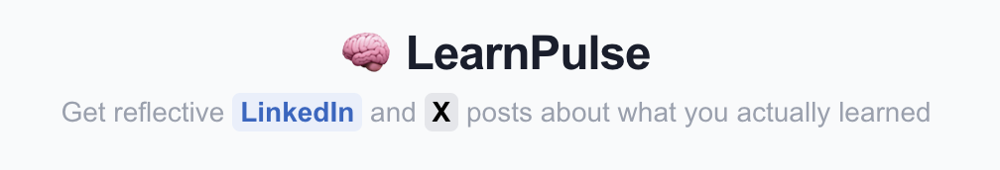

# LearnPulse

**Turn your daily search history/ learnings into LinkedIn posts and tweets — automatically.**

---
## Demo Video
[](https://youtu.be/9UbrBIRn8T0)


---

## The Problem

You learn a ton every day. Debugging that weird async bug. Reading about TCP handshakes. Going down a rabbit hole on connection pooling at 11pm.

But you never post about it. Too much effort to write something meaningful. So that learning stays invisible — to your network, and honestly, even to yourself.s

## What LearnPulse Does

Gets your Search/Browsing history through a chrome-extension or you can paste the topics. LearnPulse reads it, finds your learning moments, groups them into topics, and writes LinkedIn posts + tweets that sound like *you* — not a bullet-point summary.

**In 60 seconds, your messy search history becomes:**

~~~
 I thought building a Chrome extension would be a chill weekend project. I was wrong. It's less like building a tiny app and more like trying to explain the plot of 'Inception' to a very literal-minded robot.

You start with a simple idea, like a button that does a thing. Then you meet the 'manifest.json' file, which is basically your extension's overly strict passport control officer. It demands to know everything upfront. Then you realize your React components are living in one universe, and the browser's background scripts are in another, and they can only communicate by throwing messages over a very high, bureaucratic wall.

My biggest 'aha' moment? The popup UI you click on is just a temporary, glorified webpage. The real, persistent brain of the operation is a separate 'background script' that runs silently. So you're basically building a Jekyll-and-Hyde app where one half is a flashy frontend and the other is a creepy, always-watching butler.

Anyone else built an extension and felt like they were architecting a digital spy network for a single, slightly useful task?

hashtag#ChromeExtension hashtag#WebDevelopment hashtag#ReactJS hashtag#JavaScript" 
~~~

That's a LinkedIn post. Ready to copy-paste.

---

## How It Works

```
Your search history  →  AI classifies intent  →  Groups related topics  →  Writes your posts
```

LearnPulse runs a 4-stage AI pipeline:

| Stage | What happens |
|-------|-------------|
| **Ingest** | Parses your exported browser history (from extension or raw paste) |
| **Classify** | Labels each query: learning, debugging, exploring, reference, building, or noise |
| **Cluster** | Groups related queries into coherent learning journeys |
| **Generate** | Writes a LinkedIn post + tweet for each learning cluster |

The key insight: **search queries are the new learning signal.** With AI-powered search (Google, Perplexity, ChatGPT), you consume knowledge directly from results — you don't always click links. LearnPulse treats every query as a learning moment.

---

## Chrome Extension

LearnPulse ships with a Chrome extension that automatically captures your searches as you browse — no manual export needed.

It captures:
- Google searches (including AI Overview queries)
- Your browsed URLs as depth signals

Click **Open LearnPulse** in the extension popup → your history flows directly into LearnPulse.

---

## Setup

### 1. Clone & install

```bash
git clone https://github.com/pramodreddypandiri/LearnPulse.git
cd LearnPulse
npm install
```

### 2. Add your DeepSeek API key

```bash
# .env.local
DEEPSEEK_API_KEY=your_key_here
```

Get a key at [platform.deepseek.com](https://platform.deepseek.com) — it's cheap, fast, and the reasoning quality is excellent for this use case.

### 3. Run

```bash
npm run dev
```

Open [http://localhost:3000](http://localhost:3000).

### 4. (Optional) Chrome Extension

```bash
cd chrome-extension
npm install && npm run build
```

Go to `chrome://extensions` → Enable Developer mode → Load unpacked → select the `chrome-extension/` folder.

---

## Tech Stack

- **Next.js 14** (App Router) + TypeScript strict mode
- **Tailwind CSS v4**
- **DeepSeek API** via OpenAI-compatible SDK
- **Zod** for input validation on all API routes
- **Chrome Extension** (Manifest V3) — content scripts + service worker

---

## Post Style Guide

LearnPulse is opinionated about tone. It writes posts that feel like real people reflecting on their work — not AI-generated summaries.

**It will never write:**
- ❌ "Today I learned about X, Y, and Z"
- ❌ "Here are 5 things I read today"
- ❌ "Never stop learning! 🚀"

**It always writes:**
- ✅ First-person, conversational, specific
- ✅ Story-driven (started here, ended up there)
- ✅ One genuine insight per post

You can also add **Post Instructions** to guide the AI:
- *"Focus on the debugging journey, not the solution"*
- *"Write for a React developer audience"*
- *"Emphasize the production impact"*

---

## Roadmap

- [x] Phase 1 — Paste history → generate posts (MVP)
- [x] Phase 2 — Chrome extension for automatic capture
- [ ] Phase 3 — Add features to customize posts


---

## Development

```bash
npm run dev          # Dev server
npm run build        # Production build
npm run test         # Vitest
npm run lint         # ESLint + Prettier
npm run type-check   # TypeScript strict check
```
